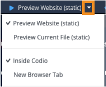

# Codio Web Project Template
This starterpack serves as a template for Web(HTML/CSS/JavaScript) projects in Codio.

## Open index.html via file tree
Click on the index.html file in the file tree to open it in the code editor.

You can right-click in the file tree to rename this file or delete it and start from a new file (see below).

## View site or Current file
Use the Preview button (with the "play" icon) to see a preview of the website.

Use the drop-down arrow to the right of the "Preview Website" option to change the button to view the current file. You can also configure your preview button to open the preview as a new tab inside Codio, or as a new tab in your browser.

## Reconfigure your Panels for easier development
Use the **View > Panels** menu on the top tool bar to segment your screen.

Simply drag the tab of the file or terminal (the part with the name) you want to move into the new panel.

## Make a new file
Use **File > New File...** or right-click in the file tree to create a new file.

As Codio detects which file is in focus, simply put your cursor into whichever code editor you want to preview and use the "Preview Current File".